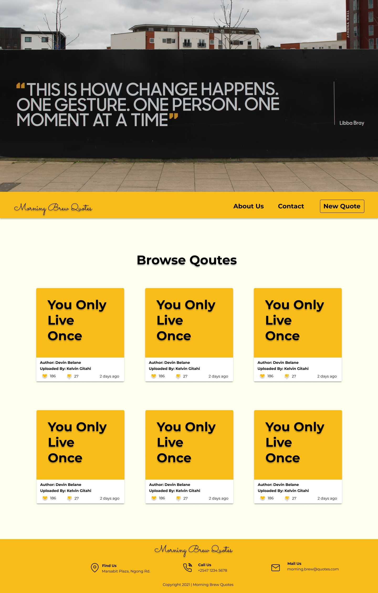

# Quote Generator

#### Quote generator is a platform that allows users to post quotes and react on posted quotes with likes or dislikes, August 2021

#### By **Kelvin Gitahi**

## Description

We all need words of motivation and encouragement. Some of us know words of encouragement and need to tell the world. Quotes for all, including you  <strong>This is where you belong</strong>.

## Setup/Installation Requirements

- You need a good perfoming computer/laptop: Core i3 or equivalent with high resolution display
- Clone from Github
- This project was generated with [Angular CLI](https://github.com/angular/angular-cli) version 12.2.0.
- Run `ng serve` for a dev server. Navigate to `http://localhost:4200/`. The app will automatically reload if you change any of the source files.
- All done!
- Easy Peasy😉
- Alternatively, go [here](https://kwathuta.github.io/pizza-store/)

To get more help on the Angular CLI use `ng help` or go check out the [Angular CLI Overview and Command Reference](https://angular.io/cli) page.

## Known Bugs

There are no known bugs currently but I look forward to improving the overall user experience

## Technologies Used

This site was made entirely using:

- HTML
- CSS
- JavaScript
- TypeScript
- Bootstrap

## Support and contact details

I'd love to chat! Ping me on [Twitter](https://twitter.com/kevocb) should any issues arise, or just say Hi!

### License

_MIT Licence_
Copyright &copy; 2021 **Kelvin Gitahi**
